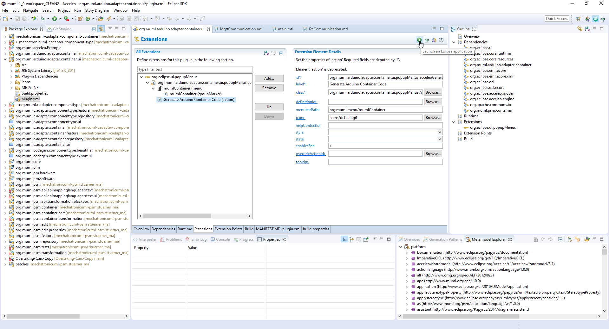

# Developer Documentation 

This documentation server the purpose to assist potential future developers in getting started with the code generation for distributed deployment. It links the relevant source code repositories, describes the setup of a suitable development environment, and gives additional hints on known difficulties.

## The Source code repositories

The relevant source code repositories for the distributed code generator are the following ones. They all expose their functionality via an Eclipse plugin. Eclipse plugins are implemented in Java, a lot of the code is generated. The acutal functionality of the plugin may be implemented with other languages / tools and is integrated into Eclipse via the plugin code. The MUML Tool Suite is an Eclipse-based IDE which simply consisist of a specific set of plugins. 
* The [Component Code Generator](https://github.com/fraunhofer-iem/mechatronicuml-cadapter-component-type): only compatibility adaptions have been implemented in the extension presented in the aforementione Master's thesis.
* The [Platform-Specific Modeling](https://github.com/fraunhofer-iem/mechatronicuml-psm): Contains the MechatronicUML Deployment Configuration metamodel with its extensions for MQTT and I2C communication presented in the aforementioned Master's thesis. The original DDS configuration is also still supported. The repository also conatins the QVTo transformation to generate a deployment configuration from an allocation specification. 
* The [Container Code Generator](https://github.com/fraunhofer-iem/mechatronicuml-cadapter-component-container): Contains the Acceleo model-to-text transformation to generate the source code. This is where the original C container code generation is implemented. The source code generation for Arduino has been added here. 

## Setting up the MUML Tool Suite as IDE

The MUML Tool Suite can be used both to develop as well as to launch and test the model transformation and code generation functionality. All of the code in the repositories listed above can be edited with the tools and editors that are inlcuded in the [MUML Tool Suite in version 1.0](https://github.com/SQA-Robo-Lab/MUML_1_0-win32-x86_64).

| :warning:  Be careful if you attempt to update any of the installed plugins or tools, or even the entire IDE. For me, it broke everything. If you take the MUML Tool Suite as it is in v1.0, some non-MechhatronicUML-plugins may be outdated, but therefore compatible and workding! |
| --- |

To use the extended platform modeling approach, simply clone the repositories into the workspace and start one of them as an Eclipse runtime instance (see next). Additionally, some metamodel plugins are required. They have to be cloned into the workspace as well: 
* the ```org.muml.core``` plugin: https://github.com/fraunhofer-iem/mechatronicuml-core
* the ```org.muml.pim``` plugin: https://github.com/fraunhofer-iem/mechatronicuml-pim
* the ```org.muml.pm.hardware``` and ```org.muml.pm.software``` plugins: https://github.com/fraunhofer-iem/mechatronicuml-pm

## Developing Eclipse Plugins

Eclipse plugins are defined wiht a plugin.xml. This can be opened with a custom editor in the Eclipse IDE as depited in the figure below. There, all extension points can be configured as visible in the example. Additionally, it also provides the option to launch a runtime Eclipse instance which contains the plugin as well as all addtional plugins that are available in the workspace. 




## Acceleo tooling

Acceleo files have the file ending ```.mtl```. Acceleo projects are built automatically if the Acceleo builder is enabled (right click the project in Eclipse, and configure the properties; or use ```toggle Acceleo nature```). The Acceleo builder is often unrealiable! Sometimes it takes several runs to build the project without errors. Building transforms the ```.mtl``` into ```.emtl``` which is required to execute the transformation.

*If the Acceleo builder crashes* which happens very often, you can (a) exit and restart Eclipse or (b) close and open the respective project in Eclipse. It may take several attempts, but in 95% of the cases, it can solve the problem. If not, what has always been a successful workaround is deleting the project (after pushing the project to a remote repository) and cloning and importing it again. 

For more information about Acceleo, see:
* https://wiki.eclipse.org/Acceleo
* https://wiki.eclipse.org/Acceleo/Getting_Started
* https://wiki.eclipse.org/Acceleo/User_Guide
* https://help.eclipse.org/latest/index.jsp?topic=%2Forg.eclipse.acceleo.doc%2Fpages%2Freference%2Flanguage.html

## QVTo hints

For QVTo, the important hints are: blackbox functions are not resolved correctly in the editor, but they still work!

Also, not everything specified in the [QVT spec](https://www.omg.org/spec/QVT/1.2/) is implemented by Eclipse QVTo in the exact same way, see https://sdqweb.ipd.kit.edu/wiki/QVT. 
