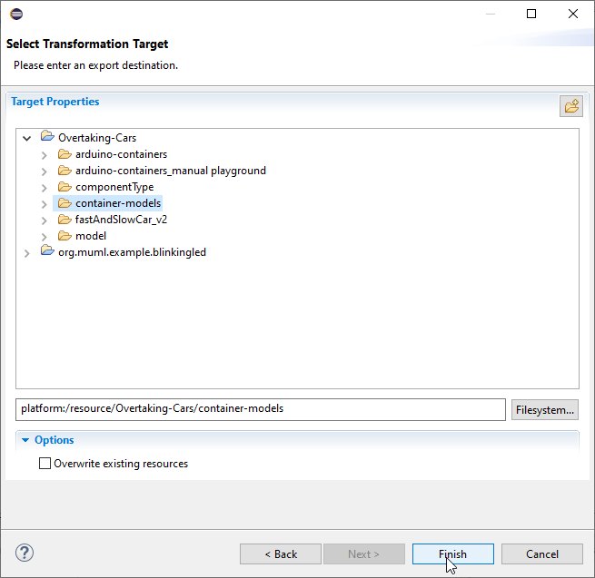

# User Documentation

This is the documentation of how to use the code generation features of the platform-modeling approach. Specifically, it describes the software construction as a user manual. The code generation process is depicted below with the exentions for the Arduino-based robot cars marked in blue:

Prerequisites:
* A MechatronicUML Platform-Independent Software model
* A MechatronicUML Hardware Platform Description model
* A MechatronicUML Allocation Specification model combining the previous two

For instance, the models contained in https://github.com/SQA-Robo-Lab/Overtaking-Cars can be used for the software contsruction (they comprise all of the above). This user manual focuses only the mandatory important parts (optional/mandatory tasks are not distinguished in the process above).

## T3.2: Deployment Configuration aka Container Transformation

Start the container transformation by right-clicking on a .muml file. Then choose "Export" and follow the steps below.

For Arduino, only MQTT and I2C are supported. DDS is supported for standard C containers. 

## T3.6 and T3.7: Container Code Generation

The Containers can be generated by right-clicking a .muml_container file. Choose between Arduino or standard C containers.

## T3.3: Component Code Generation

Start the component code generation by right-clicking on a .muml file. Then choose "Export" and follow the steps below.

